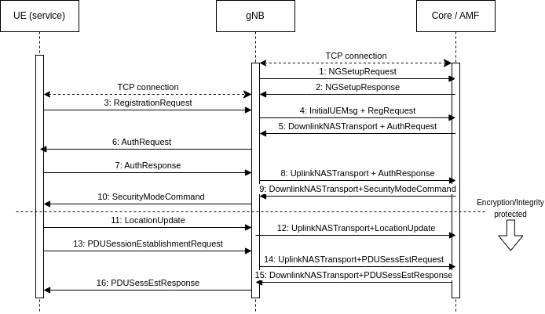

5Go phreaking
====================

This service is a simulation of a 5G network. The service consist of two main parts:

- SCTP server. Simulationg 5G core Access and Management Function (AMF) capabilities on the N2 interface.
- TCP server. Simulating User Equipment (UE).

The checker is simulating a gNodeB radio base station, and connects to both servers. The NGAP access protocol is used for seting up the 5G Packet Data Unit (PDU) session.

An attacker must create a "fake" gNB to connect UE (running over TCP) and the core (running over SCTP) with the NGAP protocol.

The gRPC server on the UE service is simulating OS location API. It is used for the putflag to store a location.

### 5G registration call flow (NGAP protocol)

