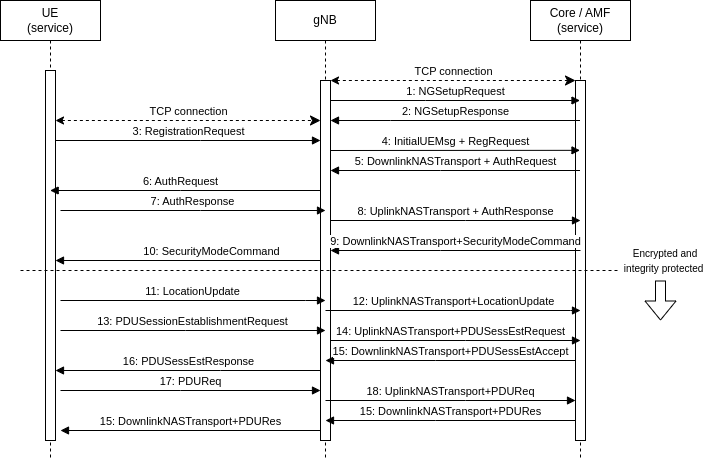
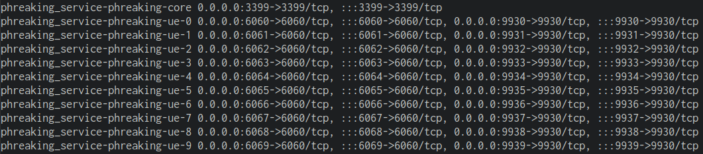

5Go phreaking
====================

This service is a basic simulation of a standalone 5G network - implementing a registration protocol inspired by [NAS/5GMM](https://www.etsi.org/deliver/etsi_ts/124500_124599/124501/17.07.01_60/ts_124501v170701p.pdf) and the [NGAP](https://www.etsi.org/deliver/etsi_ts/138400_138499/138413/16.02.00_60/ts_138413v160200p.pdf) protocol. The service consist of two docker images:

- Core: TCP server (internal port 3399) simulating 5G Access and Management Function (AMF) capabilities that can manages user equipment registration, authentication and security. The core also has a rudimentary User Plane Function (UPF), so when the phone is registered it can "request data from the internet". The response is just a hardcoded HTML page.
- UE (User Equipment): TCP server (internal port 6060) simulating a "5Go-enabled" phone, which connects to the Core and makes a fake [Gohper protocol](https://en.wikipedia.org/wiki/Gopher_(protocol)) request to the "internet". It also contains a gRPC server (internal port 9930) to simulate the operating system GPS API of the phone. It is used by checker to put flags on the UE.

In addition to these two components, a binary called `gNB` is provided. Which is a fake basestation to facilitate communication between the UE and Core, and make the service useable/interactive. Source code for this binary is in the `service_hidden` folder, which is not given teams playing this service. The `setup.sh` script in the hidden folder is used to compile the binary and copy it over to the `service` folder.

## Protocol call flow 

The flag store is in the `LocationUpdate` message, which is supposed to be encrypted.

## Setup

### Docker

Running the service will create 1 core container and 10 UE containers:

Each UE will only send one `LocationUpdate` message, containing one flag. To make flags available for 10 rounds, 10 UEs are running at the same time. Each round the checker will put a flag on UE number `currentRound % 10`. Running multiple instances of UEs is a quirk of the service, which also make it "feel" as a larger mobile network with multiple phones.

### Secrets

The service uses symmetric encryption (AES), thus each team playing this service need a unique key. The checker also needs to have the key for each team. The secrets are set in the `.env` file in the same folder as the docker-compose file for both the service and checker. 

- Service secrets:
    - `PHREAKING_GRPC_PASS`: Password for the gRPC server
    - `PHREAKING_SIM_KEY`: Key used for AES, must be of length 32.
- Checker secrets:
    - `PHREAKING_<N>_GRPC_PASS`: Password for the gRPC server. N is team number
    - `PHREAKING_<N>_SIM_KEY`: Key used for AES, must be of length 32. N is team number
    - `REDIS_PASS`: Password for checker db.

Script for generating secrets for each team can be found in this [PR](https://github.com/enowars/bambictf/pull/55/files).