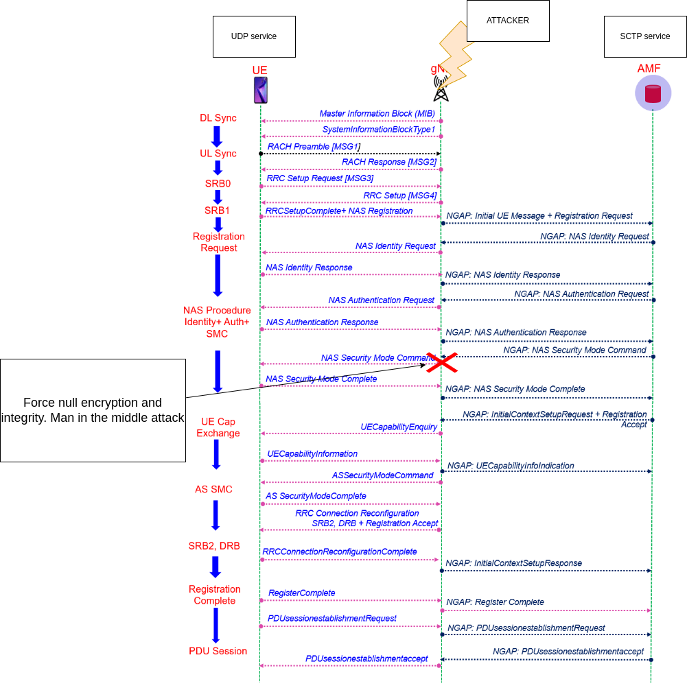

Service documentation
======================

# Vulnerabilities

## Force null encryption and integrity

- Category: Man in the middle attack
- Difficulty: medium / hard

Integrity protection IA4 is implemented to calculate the mac from a sha256 hash of message.

# Exploits
